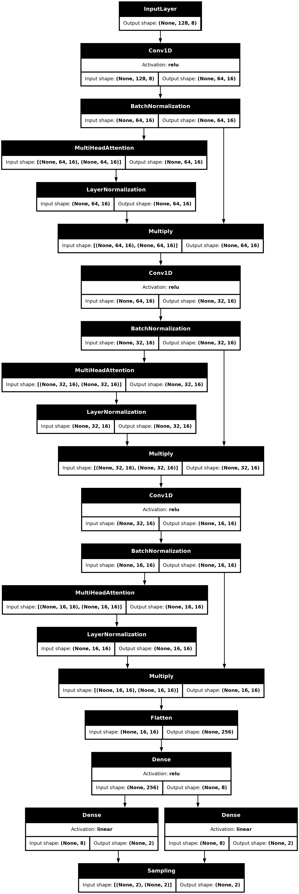
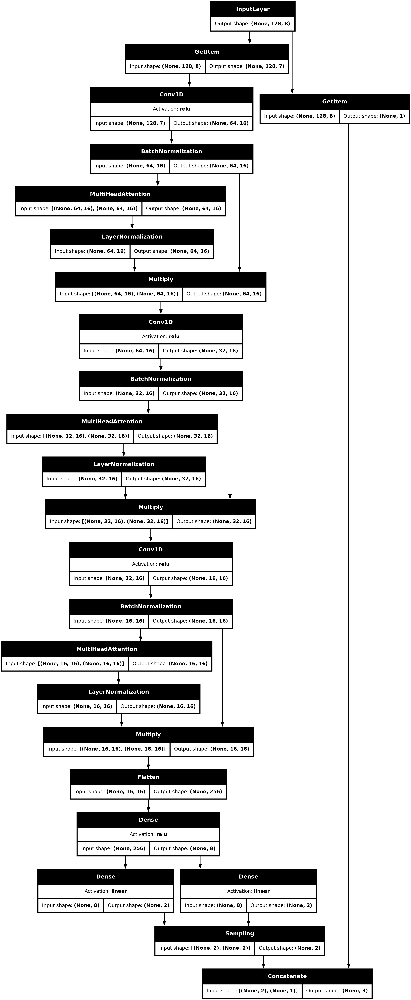

```
███╗   ██╗███████╗██╗   ██╗██████╗ ███████╗███████╗██╗     ███████╗ ██████╗████████╗  
████╗  ██║██╔════╝██║   ██║██╔══██╗██╔════╝██╔════╝██║     ██╔════╝██╔════╝╚══██╔══╝    
██╔██╗ ██║█████╗  ██║   ██║██████╔╝█████╗  █████╗  ██║     █████╗  ██║        ██║       
██║╚██╗██║██╔══╝  ██║   ██║██╔══██╗██╔══╝  ██╔══╝  ██║     ██╔══╝  ██║        ██║       
██║ ╚████║███████╗╚██████╔╝██║  ██║███████╗██║     ███████╗███████╗╚██████╗   ██║       
╚═╝  ╚═══╝╚══════╝ ╚═════╝ ╚═╝  ╚═╝╚══════╝╚═╝     ╚══════╝╚══════╝ ╚═════╝   ╚═╝ INC.      
```
# VARIATIONAL AUTOENCODER TIMESERIES CLASSIFICATION DEMO

This repository contains a demo showcasing how autoencoders can be used to classify patterns in time series data, with a focus on variational autoencoders (VAEs). It is also an excellent way to learn more about different model architectures, optimizers, activation functions, and other aspects of machine learning because it shows you live what happens in the latent layer each epoch, essentially demonstrating how the model “learns”.

The model uses an autoencoder to classify randomly generated repeating patterns in time series data. There are plots that show the model’s performance on validation data live after each epoch. It also demonstrates how the decoder regenerates output data and what the latent dimension looks like.


The structure of this notebook makes it very easy to change the encoder or decoder and see the effects of different layer types and architectures. Note that this model has been mainly built to demonstrate how VAEs perform and is not optimized for any real-world usage. To achieve that, you would need to adapt and test it further.

For more information see also the keras [example](https://keras.io/examples/generative/vae/) on which the base model and sampling layer are based.

# Installation
## Colab
The notebook can be executed in Colab [**here**](https://drive.google.com/file/d/1C5FNazC6efC32GGIwB8_RS1ZeaL4gu1O/view?usp=drive_link)
 
## Local
But if you want to run it locally (recommended) you can download the notebook here from the repository. 

### Docker container
To setup the right environment I recommend to use this container that we built if you have an NVIDIA GPU:  
[**Docker Hub**](https://hub.docker.com/repository/docker/n4321d/rapids-keras-torch-tf/general)

### Create you own enviroment
If you feel uncomfortable running random containers (which is good), or if you don’t have an NVIDIA GPU, you can easily create your own environment. These are the key packages you need:

```
keras == 3.4.1 
tensorflow == 2.16.2
holoviews == 1.19.1
panel == 1.4.4
numpy == 1.26.4
jupyterlab == 4.2.4 
```

Other versions might work as well but have not been tested.


# Usage

**TL;DR:** press Run All -> Wait for the `UserWarning` to raise and stop execution -> Run last cell

**Full instructions:**  
Just run the notebook. At the end before you start the training it will raise a `UserWarning`:
```
UserWarning: Force stop here to give live image time to load, please run next cell manually after image is loaded

---------------------------------------------------------------------------
UserWarning                               Traceback (most recent call last)
Cell In[1], line 4
      1 # The warning raised here is to stop execution of the code until the image is loaded. If you run the next cell immediately the image will not update. 
      2 # Please wait until you see the image and then manually run the next cell with the train function
----> 4 raise UserWarning("Force stop here to give live image time to load, please run next cell manually after image is loaded")
```
This is because if we dont wait for the live plots to show, they wont update. 
I havent found a better solution than this:   
Wait for the plots to show and then run the last cell where you call train():
```
%%time
train(batchsize=256, epochs=600)
```
If anyone knows how to fix that, please create a pull request or post your suggestion.

## VAE Demo
This notebook demonstrates how a variational autoencoder (VAE) can be used to detect patterns in a signal without supervision. A signal generator creates a predefined number of signals that repeat themselves (x) times in a time trace. Noise is then added, and the signals are shuffled. Signals are “manually” labeled based on the most dominant signal in each window of a sliding window view using the mode. This labeling is only used for plotting to visualize how the model classifies the signals.

The encoder uses convolutional layers to detect features of the input signal. It then projects onto two different dense layers that together form the latent dimension: one predicts a mean, and the other predicts a normally distributed variation. Using these two layers, a normal distribution is calculated, and a random sample from that distribution is sent to the decoder. The decoder uses convolutional transpose layers to upscale the signal, followed by a GRU layer to create an output signal. Both the encoder and decoder use multi-headed attention to emphasize the differences between patterns.

### Live Plots
During training the live plots show the performance of the model after each epoch. They also show the prediction of the model on a sample of the validation data:


## Time Encoding and Bypass
This VAE uses time encoding to help the decoder with the sliding windows that contain the patterns or parts of the patterns. With time encoding passed through the encoder and decoder, the patterns are classified on a circle where the center represents noise, and each pattern is further away from the center. The rotational direction of each point indicates where the encoder detected the pattern in the window.


However, for real-world applications, this is not always useful because the timing might not always be known or available. A practical way to address this is to pass time encoding (essential for training) directly to the decoder, bypassing the encoder. This way, the decoder “knows” where in the window it has to reconstruct the pattern and achieves good matches, while the encoder only has to classify which pattern is most common in the window. To do this, you can run the notebook with the `build_model(..., time_bypass=True)` keyword argument.

This will send the last value from the time encoder directly to the decoder, so the encoder just learns to detect the patterns without any indication of where in the window they occur.

The latent dimension (output) of the encoder looks like this with time encoding **bypass enabled**: 
    

It is clear that the patterns are clustered well together and noise is separated. But there is a less clear time structure then with time encoding. Other even less time aware patterns can be achieved as well if with different model architectures, but that would complecate the demo.

### Encoder & Decoder Architecture
Here is an overview of the encoder and decoder architechture. The Encoder is shown with and without bypass enabled. The decoder stays the same:        

|Encoder                                                 |  Encoder (Bypass Enabled) | Decoder  | Decoder (Bypass Enabled)|
|---------------------------------------------------------|---------|---|----|
| |  |  |  |

## Other
- With `time_bypass` disabled the model needs 60 - 100 epoch to start showing clustering, with `time_bypass` enabled it takes more around 300 - 400 epochs for clusters to show
- we fixed all random parameters as much as possible with seeds, but differences in hardware and other factors might produce different results